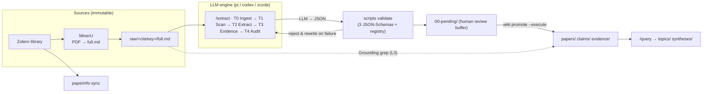

<p align="center">
  
</p>

**[Demo vault](demo/) · [Documentation](docs/en/) · [中文文档](README.zh.md) · [Architecture](ARCHITECTURE.md) · [Changelog](CHANGELOG.md)**

[](https://github.com/hasibagen/claimtrace/actions/workflows/ci.yml)
[](LICENSE)
[](pyproject.toml)
[](https://github.com/hasibagen/claimtrace/releases)
[](INVOKE.md)

**ClaimTrace is an evidence wiki that your AI coding agent writes and maintain, and that you can audit.**
Papers become **claims** (atomic propositions) and **evidence** (verbatim quotes with provenance), linked by **typed edges** (`supports` / `contradicts` / `qualifies`) into a synthesis-ready knowledge graph — plain Markdown, Obsidian-native, git-versioned.

The core guarantee is in the name: **every claim traces back to a quote you can grep.**

> Battle-tested on a live research vault: **1,124 papers → 5,340 claims → 7,422 evidence nodes**
> across 2,279 immutable sources, maintained through 2,700+ commits of daily batch extraction.

---

## The 30-second trace

This is the whole idea. Take the claim
[`caffeine restores working-memory accuracy after sleep deprivation`](demo/claims/caffeine-restores-wm-accuracy-after-total-sleep-deprivation.md)
from the [demo vault](demo/) (3 fictional papers, fully extracted):

1. **Claim** → `evidence_targets` points to `[[chen-2024-caffeine-3back-accuracy]]`
2. **Evidence** → carries the verbatim sentence, the section, the stats (`t(23) = 4.21, p < .001, d = 0.86`)
3. **Source** → the quote must exist in the immutable raw layer:

```bash
grep -F "3-back accuracy was higher after caffeine" demo/raw/chen_2024_neurophotonics/full.md   # ✓ hit
```

Step 3 is not a convention — it is enforced. The same check, plus seven more layers
(naming, JSON-Schema, semantics, wikilink integrity, …), runs on every push:

```bash
python scripts/wiki_common.py lint --wiki-root demo
# ✓ All 8 layer(s) clean
```

<details>
<summary><b>What an evidence node actually looks like</b> (frontmatter — the only thing anyone edits)</summary>

```yaml
---
type: evidence
evidence_id: chen_2024_neurophotonics-E1-3back-accuracy
fact_type: empirical_result
source: "[[chen_2024_neurophotonics]]"
observation: "In a 24-h total sleep deprivation crossover (n = 24), 200 mg caffeine
  raised 3-back accuracy from 78.2 ± 6.4% (placebo) to 85.7 ± 5.9%
  (t(23) = 4.21, p < .001, d = 0.86) [§Results/Behavior]."
interp_origin: author
interp_text: "After total sleep deprivation a moderate caffeine dose recovers a
  substantial part of the working-memory accuracy deficit ..."
prov_paper: "[[chen_2024_neurophotonics]]"
prov_section: "§Results / Behavior"
prov_source_text: "Across participants, 3-back accuracy was higher after caffeine
  than after placebo (85.7 ± 5.9% vs. 78.2 ± 6.4%; t(23) = 4.21, p < .001, d = 0.86)."
verify_test_method: t_test_paired          # enum-constrained
verify_test_stat_type: t
verify_test_stat_value: 4.21
verify_effect_size_type: cohen_d
verify_effect_size_value: 0.86
supports_targets: ["[[caffeine-restores-wm-accuracy-after-total-sleep-deprivation]]"]
supports_confidences: [high]
supports_relations: [direct]
strength: strong
---
```

The body below the frontmatter is **rendered** by `wiki_render_nodes.py` — bodies are a
pure function of frontmatter, so they can never drift from the data.

</details>

## Why ClaimTrace?

- 🔍 **Traceable by construction.** Every number and quote in a node must grep-match the
  immutable `raw/<citekey>/full.md` source. Lint checks it; CI enforces it.
- 🤖 **Agent-native.** 10 micro-skills turn "process this paper" into a typed, gated
  workflow your LLM coding agent already knows how to run — with `pi`, `codex`,
  `zcode`, or any Claude-style agent that reads `SKILL.md`.
- 🛡️ **Anti-hallucination by design.** *LLM extracts, scripts validate, humans review.*
  Agents write to a `00-pending/` buffer; nothing enters the vault until
  `wiki promote` passes the gate. The 11 iron rules are load-bearing, not decorative.
- 🔗 **Knowledge that compounds.** Claims are atomic and cross-paper; evidence attaches
  with typed, confidence-rated edges; contradictions are preserved as knowledge and
  resolved in synthesis (Evidence × Claim matrix, GRADE strength, ABT narrative).

## How it works



| Layer | Directory | Holds | Naming |
|---|---|---|---|
| Source (immutable) | `raw/<citekey>/` | MinerU conversion of the PDF | `full.md` |
| Core 1 | `paperinfo/` | Zotero-synced identity | `<citekey>.md` |
| Core 2 | `papers/` | structured reading notes | `<citekey>.md` |
| Core 3 | `claims/` | atomic propositions + typed edges | `<semantic-slug>.md` |
| Core 4 | `evidence/` | verbatim quotes + stats + provenance | `<author>-<year>-<slug>.md` |
| Core 5 | `syntheses/` | Evidence × Claim matrices, GRADE, ABT | `<question-key>.md` |
| Auxiliary | `topics/`, `00-pending/` | maps of content; review buffer | — |

<details>
<summary><b>The 11 iron rules</b> (the constitution agents load on every session)</summary>

1. **RAW IS IMMUTABLE** — Zotero / MinerU sources are never modified
2. **MARKDOWN IS THE SOURCE OF TRUTH** — no database; JSON is scratch only
3. **LLM EXTRACTS, SCRIPTS VALIDATE** — semantics by LLM, mechanics by scripts
4. **NO REGEX ON MEANING** — no regex ever extracts a semantic field
5. **PROGRESSIVE DISCLOSURE** — frontmatter visible; bodies render on demand
6. **CONTEXT OPTIMIZATION** — minimal context, read on demand
7. **EVERY FACT HAS PROVENANCE** — locatable quote for every important fact
8. **EVERY NUMBER IS VERIFIABLE** — numbers grep back to `raw/` full text
9. **CLAIM ≠ PAPER CONCLUSION** — what a paper claims ≠ what it concludes
10. **HUMAN REVIEWS PENDING** — LLM writes `00-pending/`; humans promote
11. **GRAPH EDGES ARE TYPED & CONFIDENT** — type + confidence on every edge

</details>

## Quick start

**Prerequisites:** Python ≥ 3.10 · an LLM coding agent (pi / codex / zcode / Claude-style) ·
[MinerU](https://github.com/opendatalab/MinerU) for PDF→markdown · [Obsidian](https://obsidian.md) (optional but excellent)

```bash
git clone https://github.com/hasibagen/claimtrace.git ~/.claude/skills/claimtrace   # or wherever your agent finds skills
cd ~/.claude/skills/claimtrace && ./install.sh     # installs the `wiki` CLI to ~/.local/bin
wiki init                                          # scaffold a vault: papers/ claims/ evidence/ ...
```

Then, inside your agent, the loop is four verbs:

```text
1. /sync        → pull your Zotero library into paperinfo/ (SQLite, local, no cloud)
2. 处理 full.md → /extract: T0–T4 pipeline → JSON → schema validation → 00-pending/
3. review       → you read 00-pending/, then `wiki promote --check && wiki promote --execute`
4. /query       → "evidence for X?" → claim/evidence matrix answer, or a synthesis node
```

Batch mode (the way the 1,100-paper vault is actually run):

```bash
.skill/scripts/wiki_run_extract.sh --engine zcode citekey1 citekey2 ...   # commit-as-you-go, per-paper locks
```

## The 10 micro-skills

| Command | Skill | What it does |
|---|---|---|
| `处理 [full.md\|pdf]` · `/extract` | wiki-extract-paper | 5-stage extraction pipeline (T0–T4) |
| `/claim` | wiki-build-claim | atomic claim node with scope + typed edges |
| `/evidence` | wiki-build-evidence | evidence node with verbatim provenance |
| `/topic` | wiki-build-topic | map-of-content for cross-paper navigation |
| `/query` | wiki-query-evidence | answer research questions from the graph |
| `/lint` | wiki-lint-wiki | 8-layer health check (no writes) |
| `/sync` | wiki-zotero-sync | incremental Zotero ↔ paperinfo sync |
| `/stitch` | wiki-stitch-knowledge | LLM-judged cross-paper claim dedup/merge |
| `/audit` | wiki-audit-paper | adversarial quality interrogation of a paper's nodes |
| `/modeling` | wiki-extract-modeling | train/val/test protocol deep-read for modeling papers |

## Engines: bring your own LLM agent

Extraction is decoupled from any single CLI (see [`INVOKE.md`](INVOKE.md)):

- **pi** — batch runner default; `.pi` prompts + `wiki-tools.ts` extension included in [`engines/pi/`](engines/pi/)
- **codex** — `codex exec --sandbox workspace-write`, config from `~/.codex/config.toml`
- **zcode** — `zcode -p "<INVOKE-PREFIX …>" --cwd <vault>`, headless
- **Claude-style agents** — drop this repo into your skills directory; `SKILL.md` is the entry point

All engines share the same `INVOKE-PREFIX`, the same schemas, and the same lint —
switch mid-batch without changing anything else.

## Honest scoping — when *not* to use ClaimTrace

- You want one-off chat-with-PDF summaries → use NotebookLM or Elicit; the 00-pending
  review gate will feel like overhead (it *is* overhead — deliberate overhead).
- You don't use an LLM coding agent → the extraction pipeline has no engine to run on;
  hand-writing claim/evidence frontmatter is possible but misses the point.
- You need multi-user web collaboration → this is a local-first, git-based,
  single-researcher (or small team via git) tool.

## Comparison

| | ClaimTrace | Plain Obsidian notes | Zotero + notes | Elicit / SciSpace | NotebookLM |
|---|---|---|---|---|---|
| Local-first Markdown + git | ✅ | ✅ | ❌ | ❌ | ❌ |
| AI writes the notes | ✅ | ❌ | ❌ | ✅ | ✅ |
| Verbatim-quote provenance per fact | ✅ enforced | manual | manual | partial | ❌ |
| Numbers grep-verifiable in source | ✅ CI-checked | ❌ | ❌ | ❌ | ❌ |
| Typed claim graph (`supports`/`contradicts`/`qualifies`) | ✅ | ❌ | ❌ | ❌ | ❌ |
| Cross-paper synthesis w/ GRADE | ✅ | manual | ❌ | partial | ❌ |
| Human review gate before vault entry | ✅ | n/a | n/a | ❌ | ❌ |
| Your papers stay on your disk | ✅ | ✅ | ✅ | ❌ | ❌ |

## Documentation

- [`docs/en/tutorial.md`](docs/en/tutorial.md) — full walkthrough
- [`docs/en/architecture.md`](docs/en/architecture.md) — design in brief ([`ARCHITECTURE.md`](ARCHITECTURE.md) is the 1,700-line source of truth)
- [`docs/en/micro-skills.md`](docs/en/micro-skills.md) — the 10 skills in depth
- [`LESSONS.md`](LESSONS.md) — the production incidents that shaped the concurrency rules (start here if you'll run batches)
- [中文文档](README.zh.md) · [`docs/zh/`](docs/zh/)

## FAQ

**Do I need Obsidian?** No — everything is plain Markdown and the `wiki` CLI. Obsidian
just makes the graph delightful (wikilinks, transclusions, graph view).

**Which LLM do I need?** Any agent that can read files and run shell commands. The
production vault has run batches on MiniMax-M3, GLM-5.3, GPT-5.x via the three engines;
the skill is model-agnostic because validation catches model errors.

**How do PDFs get in?** Zotero manages the library; MinerU (or any PDF→markdown tool)
produces `full.md`; `wiki pdf2md` and the sync scripts wire the rest. The raw layer is
copied once and then never touched.

**Why not just RAG over my PDFs?** RAG answers; it doesn't *accumulate*. ClaimTrace
builds a durable, typed, reviewable knowledge graph where every answer's provenance is
a first-class node — and where "the model misremembered a number" is a lint error,
not a vibe.

**Is the demo vault real data?** No — three fictional fNIRS papers (clearly banner-marked,
fake `10.0000/…` DOIs), generated and validated by this repo's own toolchain so you can
inspect a complete vault without shipping anyone's research.

## Citation

```bibtex
@software{claimtrace2026,
  author = {hasibagen},
  title  = {ClaimTrace: An AI-Maintained, Evidence-Traceable Wiki for Academic Papers},
  year   = {2026},
  url    = {https://github.com/hasibagen/claimtrace},
  note   = {v2.0.0, formerly evidence-wiki}
}
```

## License

[MIT](LICENSE) — skills, scripts, schemas, templates, and the demo vault.
Your own vault content is yours.
