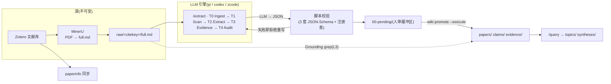

<p align="center">
  
</p>

**[Demo 演示库](demo/) · [中文文档](docs/zh/) · [English](README.md) · [架构设计](ARCHITECTURE.md) · [更新日志](CHANGELOG.md)**

[](https://github.com/hasibagen/claimtrace/actions/workflows/ci.yml)
[](LICENSE)
[](pyproject.toml)
[](https://github.com/hasibagen/claimtrace/releases)
[](INVOKE.md)

**ClaimTrace 是一个由 AI 编码代理撰写和维护、且可以被你审计的证据 wiki。**
论文被拆成 **claim**(原子命题)与 **evidence**(带溯源的原文引句),用**类型化边**
(`supports` / `contradicts` / `qualifies`)连接成可综合的知识图谱 —— 纯 Markdown、
Obsidian 原生、git 版本化。

核心保证就写在名字里:**每个论断都能溯源到一条你可以 grep 的原文引句。**

> 在一个真实科研库上长期运行:**1,124 篇论文 → 5,340 条 claim → 7,422 条 evidence**,
> 2,279 个不可变 raw 源,2,700+ 次 commit 的日常批量抽取。

---

## 30 秒看懂"溯源"

这就是全部思想。看 [demo 演示库](demo/)(3 篇虚构论文的完整抽取)里的 claim
[`咖啡因恢复睡眠剥夺后的工作记忆准确率`](demo/claims/caffeine-restores-wm-accuracy-after-total-sleep-deprivation.md):

1. **Claim** → `evidence_targets` 指向 `[[chen-2024-caffeine-3back-accuracy]]`
2. **Evidence** → 携带原文逐字引句、章节、统计量(`t(23) = 4.21, p < .001, d = 0.86`)
3. **Source** → 引句必须能在不可变 raw 层命中:

```bash
grep -F "3-back accuracy was higher after caffeine" demo/raw/chen_2024_neurophotonics/full.md   # ✓ 命中
```

第 3 步不是君子协定,而是**强制校验** —— 这条检查外加另外七层(命名、JSON-Schema、
语义、wikilink 完整性……)在每次 push 时由 CI 运行:

```bash
python scripts/wiki_common.py lint --wiki-root demo
# ✓ All 8 layer(s) clean
```

<details>
<summary><b>evidence 节点长什么样</b>(frontmatter —— 唯一的维护面)</summary>

```yaml
---
type: evidence
evidence_id: chen_2024_neurophotonics-E1-3back-accuracy
fact_type: empirical_result
source: "[[chen_2024_neurophotonics]]"
observation: "24 小时完全睡眠剥夺交叉设计(n = 24)中,200 mg 咖啡因将 3-back
  准确率从 78.2 ± 6.4%(安慰剂)提高到 85.7 ± 5.9%(t(23) = 4.21, p < .001, d = 0.86)[§Results/Behavior]。"
interp_origin: author
interp_text: "完全睡眠剥夺后,中等剂量咖啡因恢复了工作记忆准确率缺口的相当部分 ……"
prov_paper: "[[chen_2024_neurophotonics]]"
prov_section: "§Results / Behavior"
prov_source_text: "Across participants, 3-back accuracy was higher after caffeine
  than after placebo (85.7 ± 5.9% vs. 78.2 ± 6.4%; t(23) = 4.21, p < .001, d = 0.86)."
verify_test_method: t_test_paired          # 枚举约束
verify_test_stat_type: t
verify_test_stat_value: 4.21
verify_effect_size_type: cohen_d
verify_effect_size_value: 0.86
supports_targets: ["[[caffeine-restores-wm-accuracy-after-total-sleep-deprivation]]"]
supports_confidences: [high]
supports_relations: [direct]
strength: strong
---
```

frontmatter 之下的正文由 `wiki_render_nodes.py` **渲染生成** —— 正文是 frontmatter
的纯函数,永远不会与数据漂移。

</details>

## 为什么用 ClaimTrace?

- 🔍 **构造即溯源。** 节点里的每个数字、每句引文都必须能 grep 命中不可变的
  `raw/<citekey>/full.md`。lint 检查它,CI 强制它。
- 🤖 **代理原生。** 10 个微 skill 把"处理这篇论文"变成 LLM 编码代理已经会执行的
  类型化、带闸门的工作流 —— `pi` / `codex` / `zcode` / 任何读 `SKILL.md` 的
  Claude 式代理均可。
- 🛡️ **设计上反幻觉。** *LLM 抽取,脚本校验,人审晋升。* 代理只能写进 `00-pending/`
  缓冲区;`wiki promote` 过闸才进正式库。11 条铁律是承重墙,不是装饰。
- 🔗 **知识会复利。** claim 原子化、跨论文;evidence 以类型化 + 置信度评级的边挂接;
  矛盾作为知识保留,在 synthesis(Evidence × Claim 矩阵、GRADE 强度、ABT 叙事)中裁决。

## 工作原理



| 层 | 目录 | 存什么 | 命名 |
|---|---|---|---|
| 源(不可变) | `raw/<citekey>/` | PDF 的 MinerU 转换 | `full.md` |
| 核心 1 | `paperinfo/` | Zotero 同步的身份信息 | `<citekey>.md` |
| 核心 2 | `papers/` | 结构化阅读笔记 | `<citekey>.md` |
| 核心 3 | `claims/` | 原子命题 + 类型化边 | `<semantic-slug>.md` |
| 核心 4 | `evidence/` | 原文引句 + 统计 + 溯源 | `<author>-<year>-<slug>.md` |
| 核心 5 | `syntheses/` | Evidence × Claim 矩阵、GRADE、ABT | `<question-key>.md` |
| 辅助 | `topics/`、`00-pending/` | 内容地图;审阅缓冲 | — |

<details>
<summary><b>11 条铁律</b>(代理每次会话加载的宪法)</summary>

1. **RAW IS IMMUTABLE** — Zotero / MinerU 原始层永不修改
2. **MARKDOWN IS THE SOURCE OF TRUTH** — 不引数据库,JSON 仅作临时
3. **LLM EXTRACTS, SCRIPTS VALIDATE** — 语义靠 LLM,机械靠脚本
4. **NO REGEX ON MEANING** — 不用正则抽取任何语义字段
5. **PROGRESSIVE DISCLOSURE** — frontmatter 可见,正文按需 Transclusion
6. **CONTEXT OPTIMIZATION** — 最小化上下文,按需 read
7. **EVERY FACT HAS PROVENANCE** — 重要事实可定位原文 quote
8. **EVERY NUMBER IS VERIFIABLE** — 数值可 grep 到 raw 全文
9. **CLAIM ≠ PAPER CONCLUSION** — claim 与作者结论分开
10. **HUMAN REVIEWS PENDING** — LLM 写 `00-pending/`,人审阅才进正式目录
11. **GRAPH EDGES ARE TYPED & CONFIDENT** — 边有类型和置信度

</details>

## 快速开始

**前提:** Python ≥ 3.10 · 一个 LLM 编码代理(pi / codex / zcode / Claude 式)·
[MinerU](https://github.com/opendatalab/MinerU)(PDF 转 markdown)· [Obsidian](https://obsidian.md)(可选,但极配)

```bash
git clone https://github.com/hasibagen/claimtrace.git ~/.claude/skills/claimtrace   # 或你的代理找 skill 的任何位置
cd ~/.claude/skills/claimtrace && ./install.sh     # 安装 `wiki` CLI 到 ~/.local/bin
wiki init                                          # 生成库结构:papers/ claims/ evidence/ ...
```

然后在代理里,循环只有四个动词:

```text
1. /sync        → 把 Zotero 库拉进 paperinfo/(本地 SQLite,不走云)
2. 处理 full.md → /extract:T0–T4 流水线 → JSON → schema 校验 → 00-pending/
3. 审阅         → 你读完 00-pending/,然后 `wiki promote --check && wiki promote --execute`
4. /query       → "X 的证据?" → claim/evidence 矩阵回答,或沉淀为 synthesis 节点
```

批量模式(1,100 篇真实库的实际跑法):

```bash
.skill/scripts/wiki_run_extract.sh --engine zcode citekey1 citekey2 ...   # 逐篇 commit + 篇级锁
```

## 10 个微 Skill

| 命令 | Skill | 做什么 |
|---|---|---|
| `处理 [full.md\|pdf]` · `/extract` | wiki-extract-paper | 5 阶段抽取流水线(T0–T4) |
| `/claim` | wiki-build-claim | 原子 claim 节点(scope + 类型化边) |
| `/evidence` | wiki-build-evidence | evidence 节点(逐字引句溯源) |
| `/topic` | wiki-build-topic | 跨论文导航的内容地图 |
| `/query` | wiki-query-evidence | 从图谱回答研究问题 |
| `/lint` | wiki-lint-wiki | 8 层健康检查(只读) |
| `/sync` | wiki-zotero-sync | Zotero ↔ paperinfo 增量同步 |
| `/stitch` | wiki-stitch-knowledge | LLM 语义判断的跨论文 claim 去重合并 |
| `/audit` | wiki-audit-paper | 对一篇论文的节点做批判审问 |
| `/modeling` | wiki-extract-modeling | 建模论文的训练-验证-测试协议深读 |

## 引擎:自带你的 LLM 代理

抽取与任何单一 CLI 解耦(见 [`INVOKE.md`](INVOKE.md)):

- **pi** — 批量默认;`.pi` prompts + `wiki-tools.ts` 扩展收录在 [`engines/pi/`](engines/pi/)
- **codex** — `codex exec --sandbox workspace-write`,配置走 `~/.codex/config.toml`
- **zcode** — `zcode -p "<INVOKE-PREFIX …>" --cwd <库根>`,headless 可用
- **Claude 式代理** — 把本仓库放进 skills 目录;`SKILL.md` 即入口

所有引擎共用同一 `INVOKE-PREFIX`、同一套 schema、同一个 lint —— 批次中途换引擎,
其余零改动。

## 诚实的边界 —— 什么时候不该用 ClaimTrace

- 只想对 PDF 做一次性问答摘要 → 用 NotebookLM / Elicit;00-pending 审阅闸门对你
  就是纯开销(它确实是开销 —— 刻意的开销)。
- 不使用 LLM 编码代理 → 抽取流水线没有引擎可跑;手写 claim/evidence frontmatter
  可以,但错过了重点。
- 需要多用户网页协作 → 这是本地优先、git 化的单人(或小团队走 git)工具。

## 对比

| | ClaimTrace | 普通 Obsidian 笔记 | Zotero + 笔记 | Elicit / SciSpace | NotebookLM |
|---|---|---|---|---|---|
| 本地优先 Markdown + git | ✅ | ✅ | ❌ | ❌ | ❌ |
| AI 写笔记 | ✅ | ❌ | ❌ | ✅ | ✅ |
| 每条事实带逐字引句溯源 | ✅ 强制 | 手动 | 手动 | 部分 | ❌ |
| 数字可在原文 grep 验证 | ✅ CI 检查 | ❌ | ❌ | ❌ | ❌ |
| 类型化 claim 图(supports/contradicts/qualifies) | ✅ | ❌ | ❌ | ❌ | ❌ |
| 跨论文综合(含 GRADE) | ✅ | 手动 | ❌ | 部分 | ❌ |
| 入库前人审闸门 | ✅ | n/a | n/a | ❌ | ❌ |
| 论文留在你的磁盘上 | ✅ | ✅ | ✅ | ❌ | ❌ |

## 文档

- [`docs/zh/tutorial.md`](docs/zh/tutorial.md) — 完整教程
- [`docs/zh/architecture.md`](docs/zh/architecture.md) — 设计简版([`ARCHITECTURE.md`](ARCHITECTURE.md) 是 1,700 行的唯一权威)
- [`docs/zh/micro-skills.md`](docs/zh/micro-skills.md) — 10 个 skill 详解
- [`LESSONS.md`](LESSONS.md) — 塑造并发规则的生产事故集(要跑批量先读这个)
- [English](README.md) · [`docs/en/`](docs/en/)

## FAQ

**必须用 Obsidian 吗?** 不 —— 一切都是纯 Markdown 和 `wiki` CLI。Obsidian 只是把
图谱变得赏心悦目(wikilink、Transclusion、Graph View)。

**需要什么 LLM?** 任何能读文件、跑 shell 的代理。生产库跑过 MiniMax-M3、GLM-5.3、
GPT-5.x,三种引擎;skill 与模型无关,因为校验会兜住模型的错误。

**PDF 怎么进来?** Zotero 管库;MinerU(或任何 PDF→markdown 工具)产出 `full.md`;
`wiki pdf2md` 和同步脚本接线其余部分。raw 层复制一次,之后永不触碰。

**为什么不直接对 PDF 做 RAG?** RAG 能回答,但不*积累*。ClaimTrace 构建的是持久、
类型化、可审阅的知识图谱 —— 每个答案的溯源是一等公民节点,"模型记错了一个数字"
在这里是 lint 错误,不是玄学。

**demo 库是真数据吗?** 不是 —— 3 篇虚构 fNIRS 论文(显著标注、假 `10.0000/…` DOI),
由本仓库自己的工具链生成并校验,让你无需带走任何人的研究就能检查一个完整的库。

## 引用

```bibtex
@software{claimtrace2026,
  author = {hasibagen},
  title  = {ClaimTrace: An AI-Maintained, Evidence-Traceable Wiki for Academic Papers},
  year   = {2026},
  url    = {https://github.com/hasibagen/claimtrace},
  note   = {v2.0.0, 前身 evidence-wiki}
}
```

## 许可

[MIT](LICENSE) —— skill、脚本、schema、模板与 demo 库。你自己库里的内容归你。
