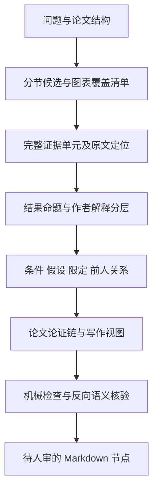

# Wiki claim 深度升级：从结果摘要到可复核的论证笔记

> 2026-09-17 · 设计与实施计划草案 · 本次仅形成计划，未实施 schema、脚本、skill 或存量节点变更。
> 后续执行可使用 superpowers:executing-plans，逐工作包验证；批量抽取前按项目契约确认引擎和模型。

**目标**：在保留 paperinfo / paper / claim / evidence / synthesis 架构的前提下，让抽取产物保留 MarginNote 笔记中的实验条件、图表层次、推理依据、作者限定、前人关系与反例，并能直接服务前言与讨论写作。

**核心方案**：分节覆盖清单 → 完整证据单元 → 有边界的原子命题 → 论文内论证链 → 反向语义核验。先修复现有契约与显示断点，再以少量扩展字段支持深读；以来源约束和人工校准保障深度。

**技术基础**：现有 Markdown/YAML、JSON Schema、Python 校验与渲染器、LLM 语义抽取。本文第 1–9 节是设计规格，第 10–13 节是实施与验收计划。

## 0. 范围、证据与不确定性

- 本计划分析的是当前本地文件快照。工具包结论来自用户保存的 ZIP，不代表远端最新版本；本次不安装、不运行其中代码。
- 阅读以金标准、实际 schema/渲染器/体检脚本、MN 代表片段为主；书籍和论文按相关章节定向阅读。没有逐页通读全部书籍、全部 11786 行 MN 或所有工具包。
- 已检视 MN 开头的 TRF/语言能力图注、§6.4–6.5 的统计与操作定义、约 7800 行的听觉皮层竞争假说与刺激操纵、约 11000 行的跨频耦合和前人关系。
- 既有金标准的“全部 8 维度”“5108 条”等属于该文档的历史汇总，本次不把它们当作全库重统计结果。
- zvec 索引不存在，改用精确文件定位与定向读取；未创建索引。memory-recall 返回的近邻与本次设计关系弱，未用其代替现有源码证据。
- 科学主张的抽取深度与科学真实性不是同一个量；本计划验证忠实、覆盖、论证可追溯，不承诺自动判断领域真理。

### 全局约束

1. Zotero / MinerU / raw 原始层只读；不为通过 grounding 修改原文。
2. Markdown 是持久真源，JSON 仅用作抽取与校验中间件，不引入数据库。
3. 语义识别由 LLM 执行；脚本检查字段、类型、定位、引用、平行数组、计数和状态，不以正则判定机制、因果或矛盾。
4. 新增、深化及拆分的知识节点仍进入 `00-pending/`，人审后 promote。
5. claim/evidence 正文由渲染器生成；paper 人写/LLM 叙事与自动段保持既有分工。
6. 增量补充优先，不重建同一论文目录，不自动清除或覆盖原有人审内容。
7. 不预设每篇必须若干 claim，不以字数、数字存在或字段填满代替质量。
8. 路径一律使用绝对路径；Python 运行与依赖遵循 conda 环境管理。

## 1. 诊断：深度不足发生在哪些位置

### 1.1 已经具备的基础，应保留

- claim / evidence 分离；有来源、统计、限定范围、支持/反对边和人工审阅缓冲。
- 2026-09-16 已加入 role_in_paper、polarity、epistemic_stance、qualifier、boundary、alternative_explanations。
- extract skill 已提出分节差异化、central claim 回读、负结果保留、深度五问。
- schema 已有 attribution、origin_section、argument_role、premises 三数组，以及 cited_targets/cited_apa。
- audit skill 已列出 scope 越界、因果误读、二手引文、数据泄漏等语义审问。

因此，不应重复宣布“新增深度五问”，也不需要另建一套知识图谱。

### 1.2 当前文件可直接证明的断点

| 断点 | 已读证据 | 对深度的影响 | 优先级 |
|---|---|---|---|
| 新深度字段未进入 claim 正文 | `wiki_render_nodes.py` 的 `render_claim_body` 渲染归属、推理、前提、scope，但未读取六个深度字段 | YAML 中已有的边界和替代解释在正文阅读及基于正文的 audit 中不可见 | P0 |
| skill 与模板使用不同契约 | build-claim 示例仍为嵌套 verification/scope/sources；当前模板/schema 为扁平字段 | 不同入口可能产生不同产物，模型把精力花在纠错而非细读 | P0 |
| 单篇支持与跨论文共识混淆 | build-claim 写“单一来源 no_evidence”，当前抽取允许单篇 empirical_result supported | 明明有实验证据却标无证据，或反向把 supported 当成领域共识 | P0 |
| 深度检查仍停留在文档层 | 金标准提出 C10–C13；当前 `wiki_audit_pending.py` 有 C9，未见 C10–C13；claim schema 的 additionalProperties 为 true | 文档“已约束”不等于执行链已落实 | P0 |
| warrant 与 mechanism 被强制拼在一起 | claim 模板定义 reasoning = 推理桥 + 机制，并设 ≥40 字 | 无机制证据时可能编补解释；长而空的重述也会过关 | P0 |
| 统计容器不足 | evidence schema 的 verify_df 为 integer/null，verify_* 为单组统计槽位 | 双自由度、GG 小数自由度、交互/简单效应及多模型结果被压进 note | P1 |
| 枚举迫使方法失真 | extract skill 明写 bootstrap 映射为 permutation_test | 重抽样方法被错误等同，可能产生形式合法的错误事实 | P0 |
| 引句规避复杂区域 | skill 建议避开 LaTeX/统计式/HTML 表格，选散文锚 | 表题命中不能证明具体单元格数字正确；关键数值可能失去精确来源 | P1 |
| 历史设计与实现不一致 | 旧 T-W7-001 计划为 cited_sources；实际 schema/lint 使用 cited_targets/cited_apa | 新计划若照旧文档执行，会倒退到第三种契约 | P0 |
| 显式角色和实际阅读覆盖脱节 | 分节流程已有，但没有候选→保留/合并/排除的覆盖记录 | “只挑容易的几条结果”难以被发现 | P1 |

这里的 P0 指开始新一轮深度试点前应解决的基础问题，不代表本次已修复。

### 1.3 实际产物说明：深度不等于更长

已读 `00-pending/diliberto_2021_front_neurosci/claims/旋律解码在想象与聆听条件下表现相似.md`：statement 已经较长，并有 reasoning。它把音高条件主效应不显著、音符起始效应、单被试置换显著及作者总体解释装在一个 `atomic: true` 命题里。

对应 evidence 将多种检验写在 observation，但 verify_* 只装入音高条件效应；原文另有方法×条件交互和适用实验范式的讨论。问题是**命题边界与证据层次**，不是文字不够多。

推荐的重构候选：

- 结果命题：在本文指定分析中，音高解码指标未检测到想象/聆听条件主效应；保留 F(1,20)=1.8、p=0.19。
- 另记方法×条件交互及对应简单效应，逐条回原文核验，不能用无主效应覆盖交互。
- 作者解释：“两条件表现相似”作为有归属的解释保留；支持程度单独评估，不将不显著升级为等效性证明。
- “两条件分别高于随机基线”与“两条件相等”是不同命题，证据不能互相替换。
- 应用推论需回读原文；“支持以想象替代外放”的强度不能仅由上述 p 值推出。

上述是设计示范，未修改这篇论文，也不是完整的重新审计结论。

## 2. MarginNote 真正值得迁移的能力

| MN 中的具体结构 | 深度价值 | wiki 落点 |
|---|---|---|
| Fig.1 D 中 N1–P2 峰峰值有组别效应，但逐时间点未发现组别效应 | 区分统计对象、聚合尺度与限定结果 | 两个 evidence 单元，结果 claim 与限定关系 |
| Fig.4 A/B/C 分别保留特征、预测指标、随机标签基线 | 区分特征解释、个体预测与分类基线 | panel 定位 + 模型/对照上下文，不合并成“EEG 预测很好” |
| Supplementary Fig.4 保留 F(1.6,150.3) 等 | 统计设计和校正不能压成一个整数 | 多自由度数组与精确统计原文 |
| §6.4 先解释为何区分 amplitude/latency，再给窗与提取规则 | 测量操作化决定命题含义 | Methods evidence + paper 操作定义；必要时 methodological claim |
| §6.5 同时保留两个主效应与不显著交互 | 负结果限定结论，不能遗漏 | 对比/效应逐项覆盖与独立语义核验 |
| 约 7800 行先比较串行/并行假说的预测，再叙述 ECS 操纵和结果 | 不是事后编机制，而是通过竞争预测组织证据 | paper 竞争解释表 + premises 链 |
| 约 11000 行保留跨频耦合伪影警告、多个前人研究及 is thought to | 限定、方法风险、二手归属与认识强度共同保存 | secondary_citation、qualifier、boundary、cited_* |
| 英文原句、中文理解、层级节点、图片链接并存 | 既便于重读，也便于写作调用 | 原文与译解分层；图片/panel 作为来源定位辅助 |

**MN 是深度参照，不是无误的事实真源。** 抽样中可见翻译/OCR 瑕疵，例如术语与音韵/语义标签可能不一致。回归标注必须重新对照论文 raw；原始图不可得时明确“仅核对图注”，不声称已看图。

## 3. 对参考资料的吸收与修正

### 3.1 方法论映射

| 来源 | 可吸收原则 | 具体改动 | 不作出的推断 |
|---|---|---|---|
| Booth《The Craft of Research》§6、§9.4、§11 | 保留主次；证据需准确、充分、代表；说明推理许可 | central/supporting、coverage ledger、warrant 与假设 | 不把所有长引句当充分证据 |
| Toulmin Essay III，原文约 732–752 行 | data、warrant、backing、qualifier、rebuttal 角色不同 | 分开支持数据、推理依据、限定与反例 | sources_targets 指向整篇论文并不自动构成 backing |
| Swales CARS，原文约 1697–1706 行 | 背景→缺口/问题/延续→研究目的 | paper 的引言链，承重命题有选择提升 | gap 不必是矛盾；修辞次序不等于逻辑推导 |
| Schimel OCAR；Mensh 2017 C-C-C | 层级叙事、问题与结果意义相连 | paper 问题—回答—意义图；synthesis 写作视图 | 不用顺畅叙事掩盖证据空缺 |
| They Say / I Say | 先准确呈现他人，再解释关系与意义 | 二手来源、引句译解、写作用途分离 | 不把用户的写作意图写成原作者主张 |
| Parkinson 2011 | Discussion 把数据、方法和文献组织成因果/条件论证 | 分节提取条件与论证连接 | 研究主要基于物理写作语料，不直接证明跨领域抽取效果 |
| Höfler 2018，Recommendations 1–5 | 设计允许的结论、希望得到的解释、所需假设分开 | warrant、assumptions、mechanism 三者区分 | “有解释”不等于机制得到检验 |
| SciClaim / Magnusson 2021 | 关联类型、实体限定和关系限定都重要 | relation_type + scope/qualifier，避免压成一个方向值 | 不搬入完整 token/span 本体 |
| SciFact / Wadden 2020 | 支持/反驳判定须带 rationale | claim↔evidence 逐边语义判定 | quote 命中只证明出处，不证明支持 |

### 3.2 对既有“金标准”的修订建议

1. 八维度改为**逐项审阅**，不要求每条均有实质内容。机制、替代解释可能原文没有；允许 not_reported / not_applicable，禁止补写充数。
2. reasoning ≥40、statement ≥25、“empirical 必须含数字”只作提示。中文短命题可能完整；无数字的定性观察可能真实；长文可能多命题混杂。
3. qualifier 字段独立有利于检索，但 statement 本身仍需保留“可能、在某条件下”等必要限制，不能正文先过度断言、再靠隐藏字段纠正。
4. “contradicts 默认 limitation 级”应取消。限定适用范围用 qualifies；只有相同可比问题上的不相容命题才考虑 contradicts。
5. polarity 的负向效应与反对某 claim 不是同一维度；null_result 也不等于“真实效应为零”。保留兼容字段并明确解释。
6. 方法论书籍的多源趋同不能直接换算为经验效应证据的 GRADE moderate。金标准应标“规范性依据、多源趋同、尚待本地评估”；若保留 grade 必须说明本地自定义含义。
7. 不用抽取器自报 confidence、字段覆盖率或字数作为已校准质量概率。

### 3.3 工具包取舍

| 本地 ZIP | 本次核对入口 | 借鉴 | 不引入 |
|---|---|---|---|
| Research-Pilot-main.zip | README、skills/deep-read-to-delta/SKILL.md | dossier/变更提案、人审、dry-run，记录理解变化 | SQLite 真源及整套图事件系统 |
| Paper-Reading-Skills-main.zip | README | 以研究问题、阅读产出、停止条件组织深读 | 所有阶段统一强制套在单篇抽取 |
| SciClaim-main.zip | README | 关系/属性/限定多层表达 | 全本体迁移与模型训练 |
| langextract-main.zip | README | 精确 span、分块、多轮找遗漏；未定位的抽取需识别 | 直接替换现有引擎/框架；未定位项不能伪装 verified |
| scifact-master.zip | README 的 rationale/label 与数据部分 | 定位任务与支持判定分离 | 把摘要验证结果当全文结论质量 |
| paperjury-main.zip | README、references/ledger-schema.md | 每个质疑有锚点、处置、关闭标准；需新证据的疑点不自动“修好” | 自动改原文、多 agent 法庭和高成本循环 |

AI 建议作为方向索引：ChatGPT 的 claim–evidence–warrant、Gemini 的主题矩阵有用；其“公认最有效”等宣传性表述不进入本计划证据。DeepSeek 等推荐书目用于导航，实际规则以本地原文及现有实现为准。

## 4. 三条路线与推荐

| 路线 | 内容 | 优点 | 主要局限 |
|---|---|---|---|
| A：只强化提示词 | 加五问、更多例子、要求更细 | 改动少 | 已基本做过；统计容器、显示和契约冲突仍存在 |
| **B：现架构内升级，推荐** | 覆盖清单、证据上下文、论证约束、来源定位、语义复核 | 可逐步验收，与现有节点兼容 | 需要 schema/renderer/lint/skill 同步 |
| C：新增笔记/论证/实体图系统 | 独立 note/warrant/argument 节点与图数据库 | 表达自由度更高 | 与 Markdown 真源及轻量维护目标冲突，迁移成本高 |

选择 B。深度主要来自阅读与信息保存机制，不来自字段数量。第一轮先完成 P0 与流程样例；结构扩展以试点确实无法无损表达的内容为限。

## 5. 目标阅读流程：保留 S0–S7，细化 S3



### T1：结构与覆盖计划

LLM 标出问题、假设、实验/研究编号、Results 小节、图表及补充材料可得性。为每个相关单元给处理去向，不用标题正则抽取科学含义。

覆盖清单放在 paper 的 LLM 叙事中，字段为：`来源位置 | 候选命题/证据 | 主次 | 去向 | 原因`。

去向限定：`保留为 claim / 保留为 evidence / 保留在 paper 方法或背景 / 合并入某项 / 排除并说明 / 缺源待核`。缺源不可标已覆盖。候选行可用 paper 内 block anchor；不创造新节点类型，不占用 pending 顶层第二个 md。

### T2a：证据先行，多遍阅读

- Results 遍：按实验、比较、指标和统计层级抽取；同时查负结果、交互、简单效应、鲁棒性和失败案例。
- Methods / 图表遍：补样本子集、操作定义、时间窗、baseline、校正、剔除、模型输入与验证划分。
- Introduction / Discussion 遍：提取承重的领域主张、竞争解释、前人关系、作者限定与意义。
- 补充材料单独列可得性；只有正文提到却未取得的内容不推测补全。

可以在同一引擎调用中顺序执行，不要求并行或新 agent。长文按自然章节分块；上一块只传候选清单与未解问题，减少摘要递归压缩。

### T2b：命题化与粒度判定

每个候选问四件事：是否表达一个可判断真假的关系？是否有完整条件？是否能独立用于检索/比较？拆开后是否丢失比较意义？

- 同一比较的 F、df、p、CI 属于一组结果，不按数字建 claim。
- 不同 outcome、实验、对照或推断层级优先拆分。
- “A 高于 B”是一个比较命题，不能拆成“A 高”“B 低”后丢掉共同对照。
- 同一命题可由多个 evidence 支持，不能每个 evidence 自动生成同义 claim。
- 操作定义/关键参数默认留 paper 与 methodology evidence；能独立支持方法选择时才建 methodological claim。
- 中心解释、经验发现和意义推论分别表示，避免把它们压进一个 atomic=true 节点。
- 去掉每节硬配额；3–8 仅为历史参考。>20 的警告触发“是否重复/过拆”审阅，不要求删到阈值。

### T2c：论证重建

按原文恢复“问题→预测→操纵→发现→解释→意义”。对每个重要 claim 回答：证据支持的确切部分是什么？依赖什么假设？作者有没有给出机制？什么条件会削弱解释？

`premises` 表示推断依赖，不表示章节相邻、笔记父子或话题相同。多个前提可能联合才支持结论，不能默认每条边独立充分。

### T3：跨节点关联

先检索已有 claim，核对关系与 scope 后复用。跨论文人群/任务/指标不同只能标可比性不足或部分关联，不能只看方向就判矛盾。单论文链和跨论文综合分开：写作用主题矩阵放 synthesis，不把跨篇推演写成某论文作者观点。

### T4：反向核验

从每条 claim 反查最小充分 evidence，再反查 raw。对 central、二手归属、因果解释、零结果和统计交互逐条审阅。再从覆盖清单反查“哪些相关信息未进入产物”。

停止条件：所有中心命题可追溯；所有相关候选有去向；关键漏项与误读已处理；未解项明确标记。时长作为预算估计，不以 5–8 分钟强制终止深读。

## 6. 最小数据扩展设计

以下均为**拟议接口**，不是当前 schema 已支持的字段。先在独立 fixture 中演练，不直接写入生产节点。

### 6.1 Claim：保留现有字段，分离三种解释

- `reasoning`：仅回答证据为何允许该命题，包含推断所需前提，不要求解释生物机制。
- `reasoning_type`：保留当前枚举；暂不为方便加大量分类。
- `argument_details`（可选对象）：保存需要独立来源的深度条目。

```yaml
argument_details:
  warrant:
    text: "该检验针对指定指标与条件差异，支持报告本次分析是否检测到该差异。"
    origin: extractor
    status: inferred
    evidence_targets: []
  assumptions:
    - text: "测量指标及分析对象必须与主张中所述一致。"
      origin: extractor
      status: inferred
      evidence_targets: []
  mechanism:
    status: not_reported
    origin: author
    evidence_targets: []
  boundary:
    - text: "未检出差异不能直接证明两条件等效。"
      origin: extractor
      status: inferred
      evidence_targets: []
```

接口约束：`origin ∈ author|cited_author|extractor|user`；`status ∈ reported|inferred|not_reported|not_applicable|unresolved`。reported 且归属 author/cited_author 的实质陈述必须指向含原文的 evidence；inferred 是显式解释，不可伪装为作者结论。缺省不等于“已查无”；只有检查相应部分后才能标 not_reported。

旧 qualifier/boundary/alternative_explanations 保留兼容；新结构启用时为细节权威值，旧字符串仅生成摘要，不允许双向分别编辑。新旧冲突必须报错或待审，不做静默覆盖。

`relation_type`（可选）：`association|difference|prediction|causal|descriptive|methodological|conceptual`。只有原文和设计支持时才标 causal；作者因果措辞与核验结论可不同，差异写在审计中。

**先行阶段可不加 argument_details**：先将三类解释在现有 reasoning 中用“推理依据/作者机制/抽取者评注”明确分段，并为作者机制单建 evidence。只有试点证明字符串妨碍来源绑定才启用结构字段，避免一次性堆字段。

### 6.2 Evidence：一个可辨识的观察或比较单元

“完整”指读者能还原：哪个实验、谁、什么条件、与谁比较、测什么、如何分析、观察是什么、在哪报告。不是每个 evidence 都必须有所有统计字段。

拟增 `study_context`：`experiment、analysis_unit、sample、condition、comparator、outcome、time_window、analysis_set、model_or_measure`，都是 LLM 抽取的可选文本。样本量区分 participant/trial/channel/site，不能把电极数当人数。

拟增 `statistics` 数组，每项包括：

| 字段 | 类型与规则 |
|---|---|
| label / outcome / contrast | 非空文本，明确对应哪个检验 |
| test_method | 经 schema 登记的真实方法；bootstrap 与 permutation 分开 |
| statistic | `{type: string, value: number或null}` |
| df | number 数组，保留 `[1.6,150.3]` 等多个小数自由度 |
| p | `{operator: eq或lt或le或gt或ge, value: number}`；可缺失 |
| effect / ci | effect 包含 type/value；ci 包含 level/lower/upper，未报告不补算 |
| correction | 作者实际报告的校正名称 |
| source_span_id | 指向本 evidence 的原文片段 |
| reporting_status | reported / derived / estimated / not_reported |

一个 outcome/contrast 的多组模型可在 statistics 内保留；不同科学观察原则上另建 evidence。旧 verify_* 对新节点只投影一项 primary statistic；多项时明确标记，不能把其他项悄悄丢掉。旧节点保持可读。

### 6.3 Provenance：定位命中与支持命中分开

保留 `prov_source_text` 作为主要原文引句；增可选 `source_spans`：

```yaml
source_spans:
  - id: primary-result
    kind: paragraph
    section: Results
    locator: "Figure 1D 对应结果段"
    quote: "从实际 raw 复制的连续原文；本例为接口说明，不是待写入数据。"
    raw_sha256: "输入 raw 的实际 SHA-256"
    start: 0
    end: 0
    match_mode: exact
```

上例 start/end 仅示意类型，实际值须脚本从 quote 定位产生；以 UTF-8 解码后的 Unicode 字符索引、左闭右开区间约定。hash 变化则定位失效，不静默指向新文本。重复引句需 section/上下文消歧。

- `kind ∈ paragraph|caption|table_cell|equation|supplement`。
- 表格保存“表号+行标签+列标签+原始片段”，不只保存表题。
- 允许保留 HTML/LaTeX 原始片段于 source_spans，主引句继续可读。LLM 选相关单元；脚本仅解析已选定位并校验。
- 数值来自表格时，数值项必须定位表格单元；caption 只能证明图表身份，不能证明数值。
- 不把首尾两锚命中当完整引句通过。精确匹配与归一化匹配分别报告，归一化不能去掉否定、比较符或数值符号。
- 图片读取另记录“已看图/仅图注”；未看图不能生成图形趋势判断。

### 6.4 状态语义先澄清，避免再添一组近义枚举

- verify_status=supported：在给定范围内有证据支持本条，不等于领域共识。
- verify_consensus：跨独立研究的状态，不由单篇默认 emerging/established；未评估应允许 unknown 或省略，需同步 schema。
- epistemic_stance：作者的表述立场，不等于核验者已证明。
- extraction_confidence：模型自评，仅辅助排审，不是可靠性概率。
- fact_type=secondary_citation：当前确实读取的是引用者文本，即使被引 paperinfo 已存在也不能改成一手实证。
- 中心 claim 依赖未定位关键证据：允许保留在 pending 标 unresolved，但不能标 verified 或完成晋升。

## 7. 论证链、树与写作视图

### 7.1 三种关系不可混用

1. **笔记层级**：MN 的父子可能是主题、图号、实验或解释。保留为 paper 内结构，不自动转成 premises。
2. **推理依赖**：某解释依赖哪些结果和假设，使用 premises；多个前提联合充分的条件写在 reasoning。
3. **证据立场**：某证据支持、反对或限定某主张，使用 supports/contradicts/qualifies。

同论文主张无需强制向“上位 claim”连 supports。没有可靠目标就留空，不能为了图密度制造推断。

### 7.2 Paper 显示两层

- 第一层：研究问题、中心答案、适用范围、主要限制、未解决疑点。
- 第二层：实验/图表覆盖表、完整 evidence、claim 论证链、竞争解释表。

新六字段必须进入正文。reader 不需要展开全部 YAML 才发现“该解释是假说”。方法/图表细节通过折叠和 transclusion 保持可用，不强行压缩进 statement。

### 7.3 写作接口先做视图

在 synthesis 或 query 输出主题矩阵：`主题问题 | 可用命题 | 支持证据 | 反证/限定 | 归属 | 可用写作角色 | 尚缺证据`。

例如：前言需背景/缺口/目的；讨论需发现/解释/比较/替代/意义。角色与原文位置分开，写作角色是用户用途，不重写作者观点。任何推荐写法都带来源，不能把多个条件不同的研究拼成无条件共识。

## 8. 质量保证：机械正确、语义忠实与覆盖分别评价

### 8.1 机械闸门

新增或升级：字段类型与版本、平行数组等长、目标存在、source_spans 定位/hash、统计值与所选片段对应关系的待核清单、必要状态约束、正文幂等。

机械检查可以发现未定位或缺字段；不能只因原文某处有同一数字就宣布数值支持正确。数字—比较—样本的绑定须语义复核。

C10/C11/C12 改为可定位的提示：短陈述、短 reasoning、无数字。C13 未知字段在新版本严格 schema 中报错；旧版本保留兼容告警，不突然让全部历史节点失效。

### 8.2 语义核验问题

- 主张与 evidence 的人群、指标、条件、方向、量级是否一致？
- claim 是否仍是一个命题？同一段多个统计是否指向不同问题？
- p 的比较符、df、校正、主效应/交互/事后分析是否保留？
- 未检出效应是否被改写为无效、等效或不依赖？
- 作者猜测、抽取者推演、实际机制检验是否区分？
- 二手引文是否保持引用链？多个同源转述有没有被当成独立研究？
- 每个 boundary/alternative 有来源或明确评注身份吗？是否因要求填满而虚构？
- 有没有支持原结论的结果被挑出来，而限制它的结果被漏掉？

每项结果为 `通过 / 可修复抽取错误 / 需缺失来源 / 科学解释待人审`，必须有锚点与关闭标准。形式检查通过不把语义项自动置通过。

### 8.3 深度评分板

八维对应金标准，每维 0/1/2：0=缺失/错误，1=部分且可定位，2=充分且忠实；不适用记 NA 并说明。总分只展示，不替代阻断项。

额外报告：

- 关键单元召回率 = 命中的人工相关单元 / 全部人工相关单元；不能让模型自己列分母。
- 支持精确率 = 经人审支持其 statement 的 claim / 抽样 claim。
- 限定/负结果保留率、二手归属正确率、图表/panel 定位正确率。
- 幻觉机制与过度断言数：任何中心命题出现一例都退回。
- 单篇 token/时间、审阅时间、节点增幅；用于观察成本，不奖励多造节点。

## 9. 回归金标准设计

首批 6 类案例，至少 4 篇实证/综述原文完整可得；按 canonical paperinfo 核对身份，不仅靠作者年份匹配。

| 案例 | 来源与任务 | 应检出的关键错误 |
|---|---|---|
| A | MN §1 Fig.1 D + Supplementary Fig.4，语言层级/TRF | 峰峰值与逐点结果混淆；小数多自由度丢失 |
| B | MN §6.4–6.5，TRF amplitude/latency | 操作定义遗漏；主效应与交互混写 |
| C | MN 约 7800 行，HG/STG 竞争假说与 ECS | 观察/操纵/模型预测混为机制已证实；sites 当 participants |
| D | MN 约 11000 行，跨频耦合综述 | 多前人合成一手结果；is thought to 丢失；伪影限定丢失 |
| E | 已有 diliberto_2021_front_neurosci raw/pending | 不显著被当等效，多指标装入单一统计槽位 |
| F | Höfler 2018 或 Toulmin 方法论片段 | 强迫无实证方法论文补 p 值或实验机制 |

A–D 是已定位的 MN 测试片段，尚未在本次确认完整对应原文的 canonical 身份；不能因为库中参考文献提到标题就视为找到全文。若原文缺失，该案例保留为阅读格式样例，不能用于数值准确率验收。

人工标注每条包括：原文锚、应保留观察、合理原子命题、限定、可接受省略、不允许推断、拆分/合并许可。MN 之外的合理新发现由审阅者裁决，不自动算 false positive。

开发集与保留集按论文分开，防止相同论文片段进入两组。对照三版：当前流程、只改 prompt、完整推荐方案。同引擎/模型/预算口径；至少保留可复查抽取记录，报告小样本而不宣称统计显著改进。

建议起始验收阈值（工程目标，非文献验证的标准）：中心命题关键单元 100% 处置；人工相关单元召回 ≥90%；支持精确率 ≥95%；来源定位和二手归属在试点人工检查中 100%；中心命题无新增过度断言。达不到先查案例与代价，不调低标准后宣称成功。

## 10. 逐文件实施工作包

下列路径以 `<wiki-root>/` 为根，均在本项目内。执行前读取具体目录 AGENTS；本文不授权批量重抽或修改其他项目。

### WP0：冻结契约基线与测试集（P0）

**新增**：`<wiki-root>/.skill/specs/claim-depth-baseline.md`；`<wiki-root>/.skill/scripts/tests/fixtures/claim_depth/`。

- [ ] 保存 schema/模板/微 skill/renderer 的当前字段和版本映射；记录 cited_sources 历史设计与 cited_* 当前实现差异。
- [ ] 对照 paperinfo 和完整原文确认 A–F 身份与可得性；选择 3 个开发案例、3 个保留案例，无法取得来源的案例替换并记录原因。
- [ ] 人工标注最小关键单元集；把源片段、旧输出和预期语义区别保存为 Markdown fixture，不触碰 raw。
- [ ] 记录基线覆盖、错误类型、审阅耗时；历史总量不直接搬用。

**输入/输出**：输入当前文件与 MN/原文；输出可重跑的案例和 source manifest。**验收**：每个计分单元有原文锚与判定规则；不可得材料不计准确率。

### WP1：统一入口契约与状态（P0）

**修改**：`<wiki-root>/.skill/skills/wiki-build-claim/SKILL.md`、`<wiki-root>/.skill/skills/wiki-build-evidence/SKILL.md`、`<wiki-root>/.skill/references/templates/claim.md`、`<wiki-root>/.skill/references/templates/evidence.md`、`<wiki-root>/.skill/skills/wiki-extract-paper/SKILL.md`。

- [ ] 以当前扁平 schema 为起点统一示例；暂保留 cited_targets/cited_apa，不把旧计划中的 cited_sources 引回。
- [ ] 删除“单篇有证据却 no_evidence”的语义规则；分开单篇支持与跨研究共识。
- [ ] 改写 reasoning 定义：warrant 必须忠实，机制按原文有无记录；取消以凑字数过关。
- [ ] 删除 bootstrap→permutation_test 的错误映射，真实未支持方法记录为待 schema 支持，不能伪标。
- [ ] 同步 deep-read/quick-scan 的描述与模式表，保留综述方法论深读。

**验收**：所有生产示例可经对应 schema 校验；同一个 fixture 从不同入口得到相同字段含义；无新科学信息由脚本补出。

### WP2：让已有深度可见（P0）

**修改**：`<wiki-root>/.skill/scripts/wiki_render_nodes.py`、`<wiki-root>/.skill/skills/wiki-audit-paper/SKILL.md`。
**新增测试**：`<wiki-root>/.skill/scripts/tests/test_claim_depth_render.py`。

- [ ] 先写 fixture：六字段齐备、旧节点完全没有深度字段、包含多行限定与特殊 Markdown 字符。
- [ ] 新增中心性、结果方向、作者立场、原文限定、边界、替代解释的正文显示；只显示已提供内容，不推断缺失值。
- [ ] audit 读取 frontmatter 与 raw，不能只读可能滞后的 body。
- [ ] 测试渲染两次一致；旧节点不凭空增加机制文本；正文每个新字段出现一次。

**验收**：MN 式限定能在正文与嵌入中直接看到；paper 人写段不改变；仅重渲染 fixture 和试点副本。

### WP3：覆盖驱动的深读协议（P1）

**新增**：`<wiki-root>/.skill/references/claim-depth-protocol.md`、`<wiki-root>/.skill/references/examples/claim-depth-mn-comparison.md`。
**修改**：extract skill、`<wiki-root>/.skill/references/templates/paper.md`、`<wiki-root>/.skill/skills/wiki-extract-modeling/SKILL.md`。

- [ ] 写入本文 T1–T4 与覆盖表；主 skill 保留路由，细则按需读取，遵守微 skill 小于 200 行目标。
- [ ] 提供结果/交互、竞争解释、综述转述三个完整正反例；例子与输入来源明确隔离，禁止复制示例事实到其他论文。
- [ ] modeling 输出的验证协议、失败案例和适用边界回流 methodological claim/evidence。
- [ ] 三个开发案例先按旧 schema 做人工引导试抽，记录实际无法表达的细节后再推进 WP4。

**验收**：候选均有去向；不靠固定数量截断；缺机制案例明确未报告；同一比较不拆碎。

### WP4：统计与来源容器（P1，依赖 WP3）

**修改**：`<wiki-root>/.skill/scripts/schemas/evidence.schema.json`、`<wiki-root>/.skill/scripts/schemas/claim.schema.json`、`<wiki-root>/.skill/scripts/schemas/_registry.py`、`<wiki-root>/.skill/scripts/wiki_render_nodes.py`、`<wiki-root>/.skill/scripts/wiki_check_evidence.py`。
**新增**：`<wiki-root>/.skill/scripts/tests/test_evidence_depth_contract.py`。

- [ ] 将第 6 节接口固化为新版本扩展；新写严格、旧读兼容。允许旧版本节点缺扩展，不自动标已升级。
- [ ] 加 statistics/source_spans/study_context；如 WP3 确有必要才加入 argument_details。
- [ ] 测试 `[1.6,150.3]`、p<0.001、未报告 p、多个 outcome、重复引句、表格单元、LaTeX 原文、hash 不符。
- [ ] primary statistic 向 legacy verify_* 投影必须显式；不能把多 df 强转整数。旧字段无法表达时保留 null+解释与新结构。
- [ ] 新旧值冲突报错；格式转换只转类型/结构，不推导科学含义。

**验收**：上述 fixture 无信息损失；未定位项保持 unverified/unresolved；bootstrap 不变成置换；旧版节点仍能读取与渲染。

### WP5：机械门与语义审阅分层（P1）

**修改**：`<wiki-root>/.skill/scripts/wiki_audit_pending.py`、`<wiki-root>/.skill/scripts/wiki_lint.py`、`<wiki-root>/.skill/skills/wiki-audit-paper/SKILL.md`。
**新增**：`<wiki-root>/.skill/scripts/tests/test_claim_depth_audit.py`。

- [ ] 实现短文本/无数字提示与新版本未知字段校验，不把启发式写成科学合格判定。
- [ ] 检查 reported 深度条目是否有 evidence 引用，缺失来源与不适用分别展示。
- [ ] 语义审阅逐项输出锚点、判定、修复类别和关闭条件；格式校验不自动填写审阅 verdict。
- [ ] 反例覆盖：较短但完整命题通过；很长但空洞的 reasoning 进入语义问题；无机制不扣幻觉式“完整度”；零结果不得推等效。

**验收**：脚本没有语义抽取正则；机械通过与语义通过分别报告；既有正式节点不被新增规则批量改写。

### WP6：同源与写作复用（P2）

**修改**：`<wiki-root>/.skill/skills/wiki-stitch-knowledge/SKILL.md`、`<wiki-root>/.skill/skills/wiki-query-evidence/SKILL.md`、`<wiki-root>/.skill/references/templates/synthesis.md`。

- [ ] 生成第 7 节主题矩阵；跨论文比较先核 scope、比较对象与研究来源。
- [ ] 二手引文与一手结果分别呈现；多个论文转述同一研究不累计为独立支持。
- [ ] 同义合并只出提案；保留 per-paper 限定与分歧，不先合成泛化命题再丢出处。

**验收**：一个跨篇写作查询能展示支持、限定、归属和缺口；不以节点计数代表独立研究数。

### WP7：试点评估与发布（P1，前述必要工作包完成后）

**新增**：`<wiki-root>/.skill/specs/claim-depth-pilot-report.md`。
**同步**：`<wiki-root>/.skill/ARCHITECTURE.md`、`<wiki-root>/AGENTS.md`、`<wiki-root>/.skill/SKILL.md`、`<wiki-root>/tasks.md`、`<wiki-root>/log/ops.md`、`<wiki-root>/.pi/prompts/extract.md`。

- [ ] 按论文划分的保留集比较三方案；引擎/模型须在启动前确认并记录。
- [ ] 报告逐案例收益、回退、耗时、成本、node 数，不只给总体均分。
- [ ] 全部契约与例子同步后，更新金标准中“已实现/拟实现”状态，移除失实的机械保障表述。
- [ ] 人审试点后才将新协议设为默认；保留旧版读路径。

**验收**：满足第 9 节阈值且无中心命题新过度断言；报告记录所有未解项；晋升仍按 S6/S7。

## 11. 验证方式与具体测试场景

测试仅针对实施后的代码行为；本次计划文档不需要虚构已通过的运行结果。执行时先确认 conda 环境中 python、pytest、jsonschema、YAML 依赖，不安装到系统 Python。

已有 registry 接口已读源码确认：

```bash
python <wiki-root>/.skill/scripts/schemas/_registry.py claim /绝对路径/测试节点.md
python <wiki-root>/.skill/scripts/schemas/_registry.py evidence /绝对路径/测试节点.md
```

上面的 `/绝对路径/测试节点.md` 表示调用形式；工作包中应替换为实际 fixture 路径。不要对没有确认参数的脚本假设存在 `--citekey` 或 `--dry-run`。

新增测试实现后运行：

```bash
python -m pytest <wiki-root>/.skill/scripts/tests/test_claim_depth_render.py <wiki-root>/.skill/scripts/tests/test_evidence_depth_contract.py <wiki-root>/.skill/scripts/tests/test_claim_depth_audit.py -q
```

最小测试矩阵：

| 输入 | 预期 |
|---|---|
| 旧 claim 无六字段 | 正常渲染，不发明内容 |
| 深度字段完整 | 正文可见，二次渲染幂等 |
| mechanism not_reported | 合法，不要求填机制 |
| 作者机制 reported 但无 evidence | 新协议下拒绝宣告完成 |
| p<0.001 | 保留 lt，不变为等于 0.001 |
| F(1.6,150.3) | 两个小数 df 均保留 |
| 同一 evidence 多 outcome | 每组统计有自己的 contrast、来源，不串接 |
| caption 命中而表格数值未定位 | 不宣告数字已验证 |
| quote 首尾命中而中段改写 | 完整匹配不通过 |
| raw hash 改变 | 旧 span 失效，不静默通过 |
| 两个不同比较方向相反 | 脚本不自动判 contradicts，交语义核对 |
| 单篇 empirical_result 有直接支持 | 允许 supported；不自动给予 established |

语义任务用人工 rubric/保留集验证，不写“字符串含 may 即通过”之类镜像测试。

## 12. 存量迁移、预算与回退

### 存量分三类处理

1. **显示修复**：已有字段未渲染。先在副本验证仅自动段变化，再分批重渲染；不会因此声称重新验证了内容。
2. **机械兼容**：旧类型到新结构只做可证明无损映射；`verify_df:20` 不能猜出另一个 df。
3. **语义深化**：回 raw 重新阅读，补条件/机制/前人关系，产出 pending 变更提案并留旧版引用。不可无依据批量填 boundary 或 epistemic_stance。

优先队列：用户近期要写作引用的论文 → central claim 高但来源弱 → 零结果/交互/多 outcome → 综述二手归属 → 一般旧节点。不启动全库“5108 条回填”。

阶段预算建议：P0 契约与显示 0.5–1.5 工作日；协议与 fixture 1–2 日；统计/定位及测试 2–4 日；试点与人工复核 1–2 日。仅为规划估计，取决于原文可得性和实现兼容负担，不作为质量截止时长。

回退按工作包：新协议未通过试点则保留旧默认；新增文件与 pending 版本保留，不删除材料；代码回退遵循项目 jj/git 实际状态与并发规则，禁止 reset/clean/stash 式清场。新字段保留读取兼容，不通过删数据降级。

批量执行继续使用 wiki_run_extract.sh 的篇级锁与落盘提交机制；如需调整 runner，另列依赖验证，不在本轮无关重构。

## 13. 建议的执行顺序与完成定义

**第一轮：WP0 → WP1 → WP2 → WP3。** 先回答“当前字段能否真正显示并驱动更忠实的深读”。这是最小可交付改进。

**第二轮：WP4 → WP5 → WP7。** 解决确实无法无损承载的统计、来源和深度来源绑定，并以保留集验收。

**第三轮：WP6 与按需存量深化。** 为写作调用提供主题矩阵，逐篇升级，不全库自动扩写。

完成应意味着：读者仅凭一个 claim 及其关联 evidence，就能理解“在什么条件下观察到了什么、作者如何解释、为什么该证据支持这个范围的命题、哪些结论尚不能得出、原文在哪里”；同时能在 paper 中看出这些命题如何共同回答研究问题。更长的 statement、更多节点、更高字段填充率都不是完成定义。

## 附录 A：本地来源入口

### 项目与用户笔记

- [现有金标准](<wiki-root>/syntheses/证据笔记与claim深度金标准.md)
- [MarginNote 原始笔记](<external-notes>/参考资料/论文写作/证据总结/资料模板/marginnote笔记.md:1)
- [MN 操作定义与主效应/交互](<external-notes>/参考资料/论文写作/证据总结/资料模板/marginnote笔记.md:670)
- [MN 竞争预测与 ECS](<external-notes>/参考资料/论文写作/证据总结/资料模板/marginnote笔记.md:7800)
- [MN 综述归属与限制](<external-notes>/参考资料/论文写作/证据总结/资料模板/marginnote笔记.md:11000)
- [extract skill](<wiki-root>/.skill/skills/wiki-extract-paper/SKILL.md)
- [claim 模板](<wiki-root>/.skill/references/templates/claim.md)
- [evidence 模板](<wiki-root>/.skill/references/templates/evidence.md)
- [claim schema](<wiki-root>/.skill/scripts/schemas/claim.schema.json)
- [evidence schema](<wiki-root>/.skill/scripts/schemas/evidence.schema.json)
- [渲染函数](<wiki-root>/.skill/scripts/wiki_render_nodes.py:225)
- [体检脚本](<wiki-root>/.skill/scripts/wiki_audit_pending.py:147)
- [历史归属与论证链计划](<wiki-root>/.skill/ref/plan-t-w7-001-claim-chain-attribution.md)
- [实际 claim 样例](<<wiki-root>/00-pending/diliberto_2021_front_neurosci/claims/旋律解码在想象与聆听条件下表现相似.md>)
- [该样例原文](<wiki-root>/raw/diliberto_2021_front_neurosci/full.md)

### 方法论原文

- [Booth：证据评价](<external-notes>/参考资料/论文写作/证据总结/前言讨论写作/书籍md/booth-way-gregory_2016_craft-of-research-4th.md:2257)
- [Toulmin：qualifier、rebuttal、backing](<external-notes>/参考资料/论文写作/证据总结/前言讨论写作/书籍md/toulmin_2003_uses-of-argument.md:732)
- [Swales：CARS](<external-notes>/参考资料/论文写作/证据总结/前言讨论写作/书籍md/swales_1990_genre-analysis.md:1697)
- [Schimel](<external-notes>/参考资料/论文写作/证据总结/前言讨论写作/书籍md/schimel_2012_writing-science.md)
- [They Say / I Say](<external-notes>/参考资料/论文写作/证据总结/前言讨论写作/书籍md/graff-berkenstein_undated_they-say-i-say.md)
- [Höfler 2018](<<zotero-md>/论文写作/证据总结/hofler_2018_bmc_med_res_methodol_writing a discussion section how to integrate substantive and statistical exper/full.md:58>)
- [Parkinson 2011](<<zotero-md>/论文写作/证据总结/parkinson_2011_english_for_specific_purposes_the discussion section as argument the language used to prove knowledge claims/full.md:15>)
- [Mensh 2017](<<zotero-md>/论文写作/证据总结/mensh_2017_plos_comput_biol_ten simple rules for structuring papers/full.md>)
- [SciClaim 原论文](<<zotero-md>/论文写作/证据总结/magnusson_2021__Extracting fine-grained knowledge graphs of scientific claims Dataset and trans/full.md:22>)
- [SciFact 原论文](<<zotero-md>/论文写作/证据总结/wadden_2020__fact or fiction verifying scientific claims/full.md:15>)

### AI 建议与本地工具快照

- [ChatGPT 建议](<external-notes>/参考资料/论文写作/证据总结/前言讨论写作/ai建议/ChatGPT_2026_08_27__1425.md)
- [Gemini 建议](<external-notes>/参考资料/论文写作/证据总结/前言讨论写作/ai建议/Gemini_2026_08_27__1425.md)
- [DeepSeek 建议](<external-notes>/参考资料/论文写作/证据总结/前言讨论写作/ai建议/DeepSeek_2026_08_27__1434.md)
- [工具包目录](<external-notes>/参考资料/论文写作/论文整理/工具包)

ZIP 内实际读取的相对成员名列于 §3.3；外部目录全部只读。方法论来源支持设计动机，本地试点评估才用于判断这套实现是否改善抽取。
